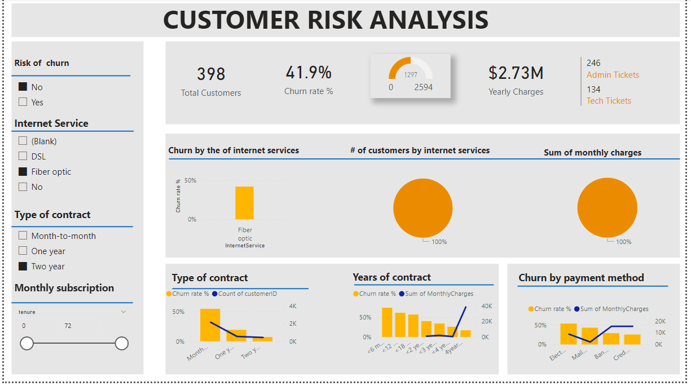

# Customer-Retention

## Introduction
This is a power bi project on customer analysis called **Customer Retention**.
The project is to analyze and derive insights to answer crucial questions and help the manager make data driven decisions.

**_DISCLAIMERS_**: _All datasets and reports do not represent any company, institutions or countries, but just a dummy dataset to demonstrate capabilities of Power BI._

## Problem Statement:
•	Demographic information about customers: gender, age range, and if they partners and dependents.

•	Services each customer have signed up for: phone, multiple lines, online security, online backup, device protection, tech support and streaming movies and TV.

•	Customers account information: how long as a customer, contract, payment method, paperless billing, monthly charges and number of tickets opened in the categories (administrative and technical).

## Data Sourcing:
Not until I came up with the above mentioned questions did I went ahead to get the data. I downloaded the csv file into Microsoft Excel to clean and add some columns using the **IF Function**, then I extracted it into Power BI for cleaning, analysis and visualization.

### It contains 2 sheets/tables:
1.	Churn with 7044 rows and 25 columns
2.	Churn Unpivot-groups with 7044 rows and 18 columns

## Skills/ Concepts demonstrated:

- DAX.
- Calculated column. 
- Duplicate data.
- Filters.
- IF().
- Page navigation.
- New Measures.
- Tooltip.
- Bookmark.
- Selection.
- Buttons.
- Slicers.

## Modelling:
It contains one fact table and one dimension table. The dimension table is joined to the fact table using a ***_many-to-one_*** relationship.

## Visualization:

The report comprises 3 pages:
1.	Welcome
2.	Churn
3.	Customer Risk Analysis	

## Welcome History: 

Features:
- Bookmark captures the state of a report page.
- Selection provides a list of all the objects on the current page and can be used to hide/unhide those objects.
- Buttons(To navigate the welcome page to both the churn and churn risk analysis pages).

## CuSstomer Demographics:

Features:
- Bookmark captures the state of a report page.
- Selection provides a list of all the objects on the current page and can be used to hide/unhide those objects.
- Icons is used to beautify the dashboard.
- Button: to navigate to the churn risk analysis.

## Customer Risk Analysis:

Features:
- Bookmark captures the state of a report page.
- Selection provides a list of all the objects on the current page and can be used to hide/unhide those objects.
- Slicers

  
## Conclusion and Recommendation:
### After the visualization I got to know that:
- 25% of the customers are senior citizens,
- 36% of the customers have partners,
- and 17% of the customers are dependents.

## Recommendation:
For a deep dive into the analytics, the dataset of other stores will be required for comparison and data driven decision making.

**_THANK YOU._** 😃

